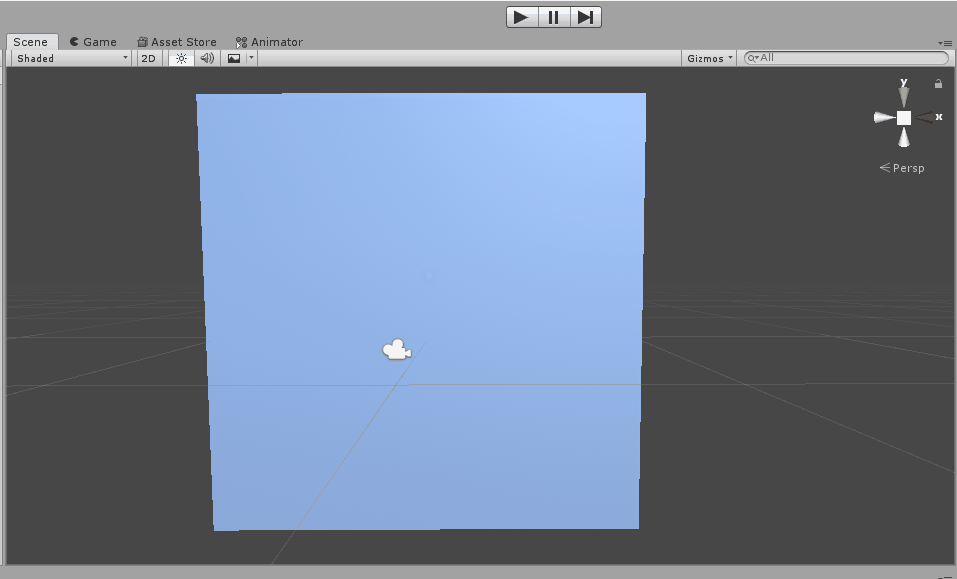
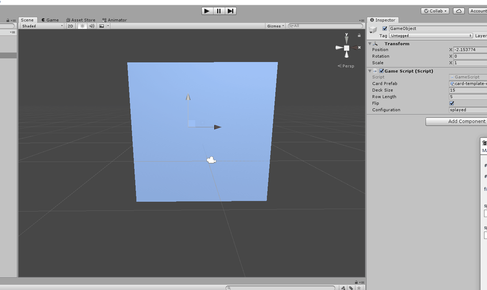
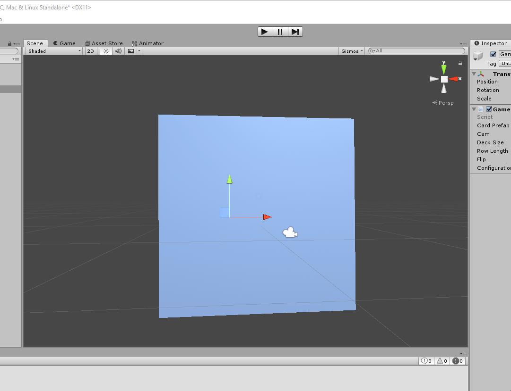

## exploring card animations with Unity    
    
### examples:
    
placing cards in rows (noticed how they're getting flipped)    
    
    
placing cards in a splayed arrangement    
    
    
other arrangements!    
    
    
    